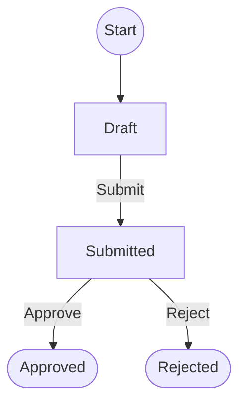

# Request — workflow

**Start**: [Draft](#phase-draft)



## Phases

<a id="phase-draft"></a>

### Draft

_Request being written by its author_

The author fills in title, description, budget and supplier, then submits the request for approval.

- **Who works it**: USERS, MANAGERS
- **Next**: Submitted

#### Configuration

| Key | Value |
|---|---|
| phase code | `draft` |
| `read` | USERS, MANAGERS |
| `edit` | USERS, MANAGERS |
| `admin` | MANAGERS |
| `is_closed` | False |
| `allow_release` | strict |
| `snapshot` | False |

`properties`:

```yaml
edit_button_label: Edit
editable_fields:
  - budget
  - description
  - supplier
  - title
```

#### Next phases

- [Submitted](#phase-submitted) — «Submit»

<a id="phase-submitted"></a>

### Submitted

_Waiting for a manager to approve or reject it_

A manager reviews the request, can add notes and a reference code, then approves or rejects it.

#### Configuration

| Key | Value |
|---|---|
| phase code | `submitted` |
| `read` | USERS, MANAGERS |
| `edit` | — |
| `admin` | MANAGERS |
| `is_closed` | False |
| `allow_release` | strict |
| `snapshot` | False |

`properties`:

```yaml
edit_button_label: Edit
editable_fields:
  - manager_notes
  - reference_code
```

#### Next phases

- [Approved](#phase-approved) — «Approve»
    - `allowed_groups`: MANAGERS
- [Rejected](#phase-rejected) — «Reject»
    - `allowed_groups`: MANAGERS
- [Draft](#phase-draft) (send back)
    - `auto`: generated from the forward transition

<a id="phase-approved"></a>

### Approved

_Request approved (closed)_

**Final phase**

Closed: the request has been approved.

#### Configuration

| Key | Value |
|---|---|
| phase code | `approved` |
| `read` | USERS, MANAGERS |
| `edit` | — |
| `admin` | — |
| `is_closed` | True |
| `allow_release` | strict |
| `snapshot` | False |

`properties`:

```yaml
edit_button_label: Edit
editable_fields: []
```

#### Next phases

- [Submitted](#phase-submitted) (send back)
    - `auto`: generated from the forward transition

<a id="phase-rejected"></a>

### Rejected

_Request rejected (closed)_

**Final phase**

Closed: the request has been rejected.

#### Configuration

| Key | Value |
|---|---|
| phase code | `rejected` |
| `read` | USERS, MANAGERS |
| `edit` | — |
| `admin` | — |
| `is_closed` | True |
| `allow_release` | strict |
| `snapshot` | False |

`properties`:

```yaml
edit_button_label: Edit
editable_fields: []
```

#### Next phases

- [Submitted](#phase-submitted) (send back)
    - `auto`: generated from the forward transition
