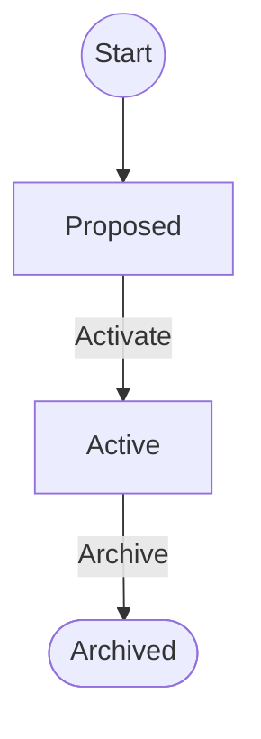

# Supplier — workflow

**Start**: [Proposed](#phase-proposed)



## Phases

<a id="phase-proposed"></a>

### Proposed

_Supplier proposed, waiting for review_

A user proposes a supplier; a manager reviews it.

#### Configuration

| Key | Value |
|---|---|
| phase code | `proposed` |
| `read` | USERS, MANAGERS |
| `edit` | USERS, MANAGERS |
| `admin` | MANAGERS |
| `is_closed` | False |
| `allow_release` | strict |
| `snapshot` | False |

`properties`:

```yaml
edit_button_label: Edit
editable_fields:
  - certification
  - company_name
  - tax_code
```

#### Next phases

- [Active](#phase-active) — «Activate»
    - `allowed_groups`: MANAGERS

<a id="phase-active"></a>

### Active

_Supplier approved: requests can target it_

Requests can target the supplier.

#### Configuration

| Key | Value |
|---|---|
| phase code | `active` |
| `read` | USERS, MANAGERS |
| `edit` | MANAGERS |
| `admin` | MANAGERS |
| `is_closed` | False |
| `allow_release` | strict |
| `snapshot` | False |

`properties`:

```yaml
edit_button_label: Edit
editable_fields:
  - certification
```

#### Next phases

- [Archived](#phase-archived) — «Archive»
    - `allowed_groups`: MANAGERS
- [Proposed](#phase-proposed) (send back)
    - `auto`: generated from the forward transition

<a id="phase-archived"></a>

### Archived

_Supplier no longer in use_

**Final phase**

The supplier is no longer used.

#### Configuration

| Key | Value |
|---|---|
| phase code | `archived` |
| `read` | USERS, MANAGERS |
| `edit` | — |
| `admin` | — |
| `is_closed` | True |
| `allow_release` | strict |
| `snapshot` | False |

`properties`:

```yaml
edit_button_label: Edit
editable_fields: []
```

#### Next phases

- [Active](#phase-active) (send back)
    - `auto`: generated from the forward transition
